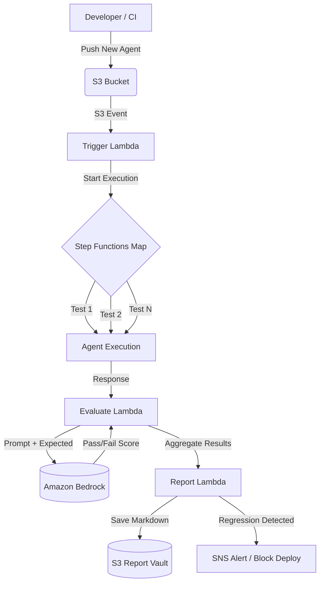

# AgentCI — Behavioral Regression Pipeline for AI Agents

> *GitHub Actions for AI agents.* AgentCI is a serverless CI/CD evaluation pipeline that catches non-deterministic behavioral drift and hallucination regressions *before* they reach production.

## The Problem: You Can't Unit Test Non-Determinism

Standard CI/CD pipelines (unit tests, integration tests) are blind to LLM behavioral drift. An AI agent that passes all tests today can start hallucinating tomorrow because the underlying foundation model was silently updated, or because a prompt tweak had unintended side effects.

If you don't evaluate your agent against a curated suite of edge-case scenarios on every commit, you are deploying blind.

## The Solution: Eval-Driven CI/CD

AgentCI intercepts agent deployments and runs them through an automated LLM-as-a-Judge evaluation pipeline.

1. **Trigger:** A developer pushes a new agent version to S3 (or triggers via API).
2. **Execute:** AWS Step Functions maps over a curated suite of test scenarios stored in DynamoDB, executing the new agent against each one.
3. **Evaluate:** Amazon Bedrock (Claude 3) acts as the judge, scoring the agent's response against the expected outcome.
4. **Gate:** If the average score drops below the threshold, or if critical safety tests fail, the pipeline halts the deployment and fires an SNS alert.
5. **Report:** A human-readable Markdown report is generated and stored in S3 for auditability.

## Architecture

## Deployment

This architecture is fully serverless and designed to be deployed via AWS SAM or Terraform.

### Prerequisites
- AWS Account with Amazon Bedrock enabled (Claude 3 Haiku)
- Python 3.11+
- Boto3

### Core Components
- `src/trigger_eval.py`: Entry point that loads the test suite from DynamoDB.
- `src/evaluate.py`: The LLM-as-a-Judge logic using Amazon Bedrock.
- `src/generate_report.py`: Aggregation, Markdown generation, and alerting.

## Integration with the Merkaba Stack

AgentCI is the pre-production companion to the rest of the Merkaba AWS agent infrastructure portfolio:
- **[AgentGuard](https://github.com/ojackson08/agentguard)**: Runtime silent failure detection
- **[AgentLedger](https://github.com/ojackson08/agentledger)**: Cost visibility and token metering
- **[AgentHandoff](https://github.com/ojackson08/agenthandoff)**: Durable context transfer
- **[CloudPulse AI](https://github.com/ojackson08/cloudpulse-ai)**: Infrastructure observability

## Security & Governance

AgentCI enforces **deployment governance**. By keeping a permanent S3 record of every evaluation report, organizations can prove exactly how an agent behaved against safety baselines before it was allowed into production.

See `SECURITY.md` for threat modeling and vulnerability reporting.

## License
MIT
